#  Dynamic Purchase Prediction using Logistic Regression & XGBoost

Welcome to my machine learning exploration where I tackled a binary classification task – predicting whether a **purchase will be made or not** 🛒. In this journey, I implemented and compared **Logistic Regression** and **XGBoost**, each with their own strengths and beauty!

---

##  Why These Models?

###  Logistic Regression
- Perfect for **binary outcomes** (like Purchase: Yes/No).
- Gives **probabilistic outputs** (not just hard classifications).
- Fast, interpretable, and ideal when simplicity matters.

###  XGBoost
- A powerful **ensemble model** using Gradient Boosting Trees.
- Captures **non-linear patterns** and **feature interactions**.
- Regularization, missing value handling, and tree pruning make it robust.

---

##  Mathematical Backbone

###  Logistic Regression

**Model Equation:**

\[
P(Y = 1|X) = \sigma(w_0 + w_1x_1 + w_2x_2 + \dots + w_nx_n)
\]

Where \(\sigma(z)\) is the **sigmoid function**:

\[
\sigma(z) = \frac{1}{1 + e^{-z}}
\]

**Loss Function (Binary Cross-Entropy):**

\[
\mathcal{L} = -\frac{1}{N} \sum_{i=1}^N [y_i \log(p_i) + (1 - y_i)\log(1 - p_i)]
\]

---

###  XGBoost

**Model Structure:**

\[
\hat{y}_i = \sum_{k=1}^{K} f_k(x_i), \quad f_k \in \mathcal{F}
\]

Each \( f_k \) is a regression tree.

**Loss Function:**

\[
\mathcal{L}(\phi) = \sum_{i} l(y_i, \hat{y}_i) + \sum_{k} \Omega(f_k)
\]

Where the regularization term:

\[
\Omega(f) = \gamma T + \frac{1}{2} \lambda \|w\|^2
\]

---

## 📐 Model Assumptions

### Logistic Regression:
-  Log-odds are **linear** in the predictors.
-  Features should be **independent** (no multicollinearity).
-  Sensitive to **outliers** unless preprocessed.

### XGBoost:
-  **No strict assumptions** — handles missing data, interactions, and non-linearity.
-  Great for tabular, structured datasets.
-  Built-in **regularization** improves generalization.

---

##  How They Predict

### 🔹 Logistic Regression

1. Calculate a **weighted sum** of input features (e.g., page views, cart value).
2. Apply **sigmoid** to squash it into a 0–1 range.
3. Output **probability** of purchase, like `P = 0.75`.
4. Use a **threshold** (e.g., 0.5) to classify as purchase or not.

### 🔹 XGBoost

1. Start with an initial prediction (average log-odds).
2. Compute errors using a **gradient loss function**.
3. Build shallow **trees** to correct previous errors.
4. Add each tree’s contribution to update predictions iteratively.

---

## 🔧 Framework Overview (Mermaid)

```mermaid
graph TD
    A[User Data] --> B{Model Type}
    B --> C1[🔹 Logistic Regression]
    B --> C2[🌲 XGBoost]

    C1 --> D1[Sigmoid]
    D1 --> E1[Probabilities: 0–1]
    E1 --> F[Decision]

    C2 --> D2[Trees Ensemble]
    D2 --> E2[Boosted Prediction]
    E2 --> F
```

